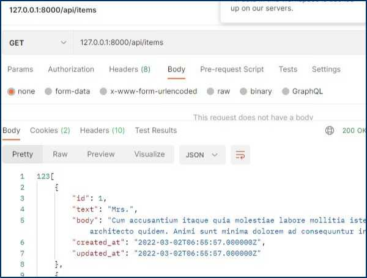
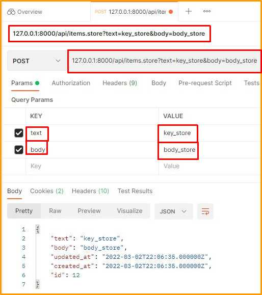
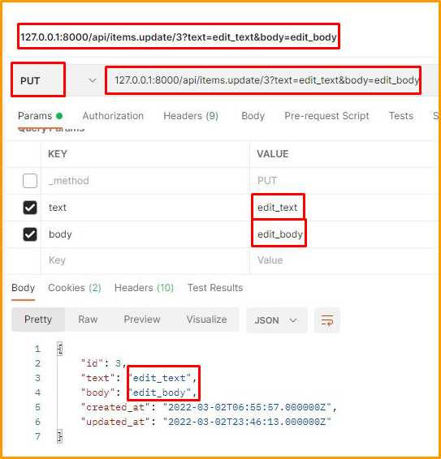
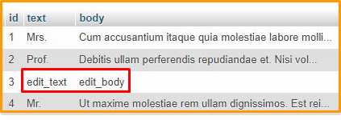

## Main stages of development

##### 1. Installation Project Template. Create Database

`composer create-project --prefer-dist  laravel/laravel .`   
`npm install`  
`npm run dev`  

`git init`  
`git add .`  
`git commit –m "Comment"`  
**`git remote add origin https://github.com/SergeyHub/chat-laravel-vue.git`**  
`git push -u origin master`  

##### 1.1 Postgersql
```
Let's start SQL Shell (psql). The program will prompt you to enter the name    
of the server, database, port and user. You can click/skip these items as they  
will use the default values   
(for server - localhost, for database - postgres, for port - 5432,  
as user - postres superuser). 
Next, you will need to enter a password for the user   
(by default, the postgres user): 123456 (in my case)  
```

   

`postgres=# create database db_name;`  
  **database list**  
`select datname from pg_database;`   
pg_dump dbname > outfile 

**`Edit  env. file`**    
```
DB_CONNECTION=pgsql
DB_HOST=localhost
DB_PORT=5432
DB_DATABASE=cargo
DB_USERNAME=postgres
DB_PASSWORD=123456
```
##### 1.2 MySQL

`mysql -u root -p`  
`create database laravel_chat; db_name;`  
`drop database db_name;`   
`show databases;`  
`use db_name;`  
`show tables;`   
`drop table table_name;`  
`exit`  

**`Edit  env. file`**   
```
DB_CONNECTION=mysql
DB_HOST=127.0.0.1
DB_PORT=3306
DB_DATABASE=roles_permission
DB_USERNAME=root
DB_PASSWORD=123456
```
##### 1.3 Migration

`php artisan migrate`  

##### 1.4 Version
`npm -v`  
`php -v`

##### 2. Installation Laravel Sanctum
[Laravel Sanctum https://laravel.com/docs/8.x/sanctum](https://laravel.com/docs/8.x/sanctum)   

`composer require laravel/sanctum`  
`php artisan vendor:publish --provider="Laravel\Sanctum\SanctumServiceProvider"`  
`php artisan migrate`  
`php artisan vendor:publish --tag=jetstream-views`
##### 3. Jetstream Inertia
`composer require laravel/jetstream`  
`php artisan jetstream:install inertia`  

`php artisan migrate`  
`npm i`   
`npm install`  
`npm run dev`

##### 4. ChatRoom -m ChatMessage -m 

```
Schema::create('chat_rooms', function (Blueprint $table) {
    $table->id();
    $table->string('name');
    $table->timestamps();
});
```
```
Schema::create('chat_messages', function (Blueprint $table) {
    $table->id();
    $table->integer('chat_room_id');
    $table->integer('user_id');
    $table->mediumText('message');
    $table->timestamps();
});
```
`php artisan migrate`

app/Providers/AppServiceProvider.php
```
use Illuminate\Support\Facades\Schema;
 public function boot()
    {
        Schema::defaultStringLength(191);
    }
```
**`items table`**
```
Schema::create('items', function (Blueprint $table) {
    $table->id();
    $table->string('text');
    $table->string('body');
    $table->timestamps();
});
```
`php artisan migrate`

##### 3. Items Factoru Seeder
```
php artisan make:factory ItemsFactory
php artisan make:factory ItemsFactory --model=Items
php artisan make:seeder ItemsSeeder
php artisan db:seed --class=ItemsSeeder
```
##### 4.Postman

- [Postman Tutorial](https://testengineer.ru/gajd-po-testirovaniyu-v-postman/).  
 

##### 5.ItemsController Methods
```
 public function index()
    {
        $items = Items::all();
        return response()->json($items);
    }

public function show($id)
    {
        $items = Items::find($id);
        return response()->json($items);
    }
```
**routes** 
``` 
Route::get('api/items', [ItemsController::class, 'index']);
Route::get('api/items/{id}', [ItemsController::class, 'show']);
```
##### 6.Handle POST Request & Insert
**`app/Http/Middleware/VerifyCsrfToken.php`** 
```
protected $except = [
        'api/*'
    ];
```
**`edit ItemsController`**  
```
use Illuminate\Support\Facades\Validator;
..........................................
public function store(Request $request)
    {
        $validator = Validator::make($request->all(), [
            'text' => 'required',
            'body' => 'required',
        ]);

        if ($validator->fails()) {
            return ['response' => $validator->messages(), 'success' => false];
        }

        $item = new Items();
        $item->text = $request->input('text');
        $item->body = $request->input('body');
        $item->save();

        return response()->json($item);
    }
```
 

 

##### 7. ItemsControlley update method
```
Route::put('api/items.update/{id}', [ItemsController::class, 'update']);

 public function update(Request $request, $id)
{
    $validator = Validator::make($request->all(), [
        'text' => 'required',
        'body' => 'required',
    ]);

    if ($validator->fails()) {
        return ['response' => $validator->messages(), 'success' => false];
    }

    $item = Items::find($id);
    $item->text = $request->input('text');
    $item->body = $request->input('body');
    $item->save();

    return response()->json($item);
}
```

 

 

##### 8. ItemsControlley destroy method
```Route::delete('api/items.delete/{id}', [ItemsController::class, 'destroy']);

public function destroy($id)
    {
        $items = Items::find($id);

        $items->delete();

        return ['response' => 'Item № '.$id.' deleted',
                'Item  = ' => $items,
                'success' => true];
    }
```
##### 9. Create Product Model Table
`php artisan make:controller ProductController --resource`
`php artisan migrate:rollback`

##### 10. Posts Section
`php artisan make:controller PostController --resource`
##### 11. Edit PostController Post blad views
